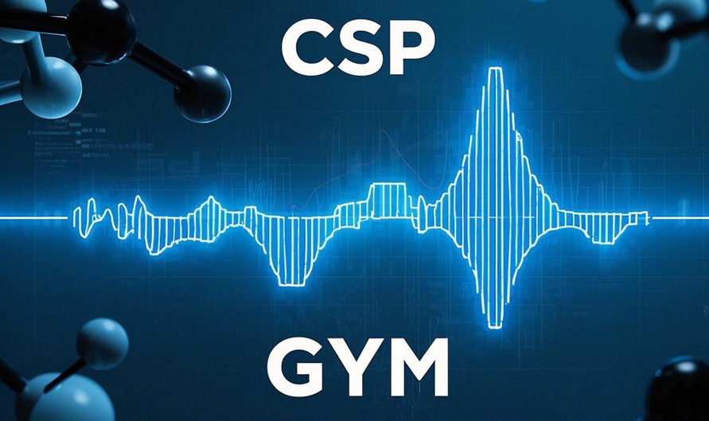

<h1>
<p align="center">
    
</p>
</h1>

<h4 align="center">


[](https://cspgym.tetean.com)
[](https://python.org/downloads)

</h4>


# No-Data-Driven Crystal Structure Prediction via Model-Free Reinforcement Learning

CSP-Gym is a benchmark environment for applying reinforcement learning to crystal structure prediction (CSP). The goal is to find the lowest energy configuration of a crystal by adjusting lattice parameters and atomic positions.

## Installation

1. Clone the repository:
    ```bash
    git clone https://github.com/tetean/CSP-Gym.git
    cd CSP-Gym
    ```

2. Install dependencies:

   CSP-Gym mainly relies on `gymnasium` `numpy` `matplotlib` `stable-baselines3`.

   ```bash
   pip install gymnasium numpy matplotlib stable-baselines3
   ```

   > There are a few other dependencies that need to be installed manually to adapt to different CUDA versions.

3. Usage

   See the [Quick Start](https://cspgym.tetean.com) script for an example of training a agent using Stable-Baselines3.

## Citation

   - If you use CSP Gym in your research, please cite:
       ```
      @inproceedings{wang2025cspgym,
        title={No-Data-Driven Crystal Structure Prediction via Model-Free Reinforcement Learning},
        author={Wang, Xiean and Chen, Pin and Zou, Qingsong},
        booktitle={International Conference on Intelligent Computing},
        pages={307--318},
        year={2025},
        organization={Springer}
      }
       ```
